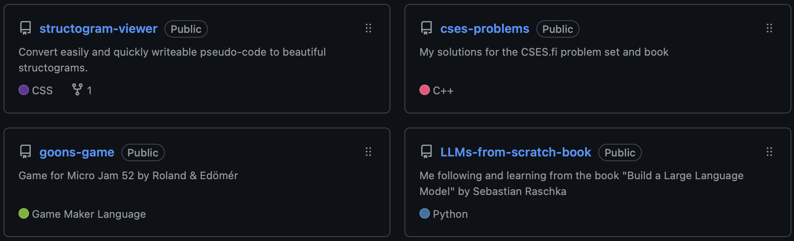
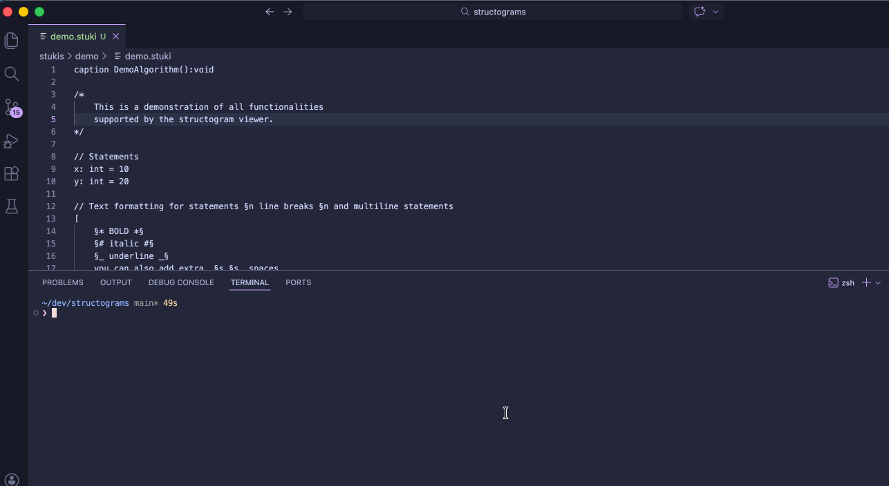
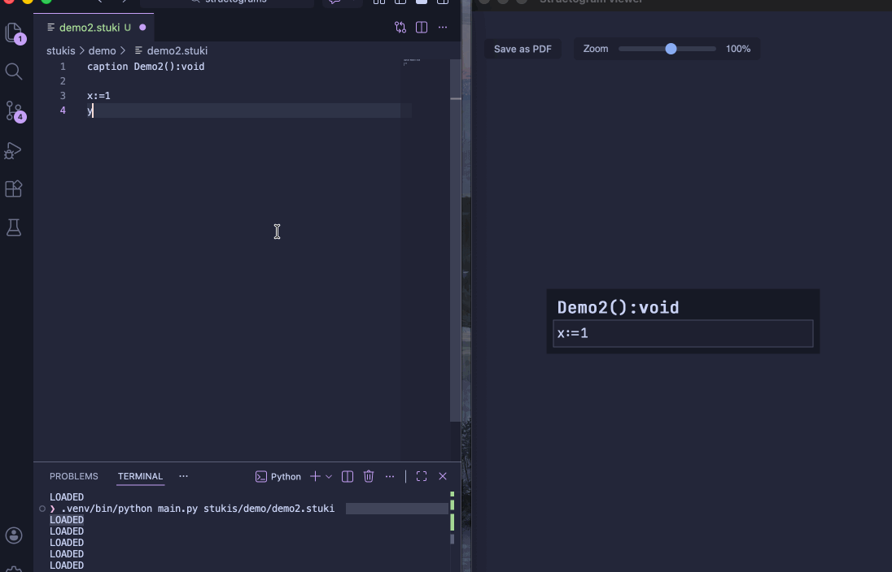
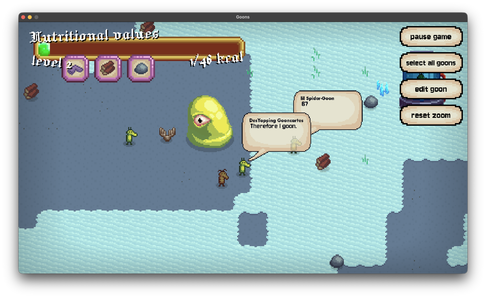
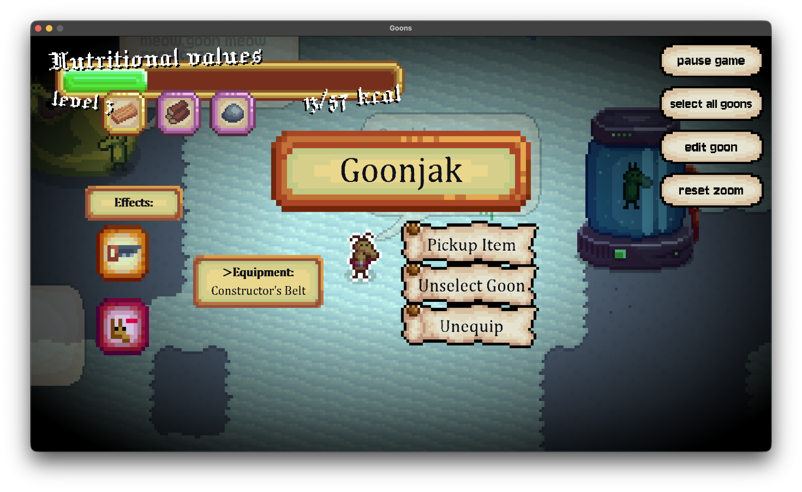

# **Edömér's Archive**   *projects*

<!-- nav -->
## *Navigation:*
- [~](../index.md)
- Projects
- [Cheat Sheets](../cheat_sheets/cheat_sheets.md)
- [Resources](../resources/resources.md)
<!-- /nav -->

## Where to find them
> Most of my projects are available on my [github](https://github.com/edxmer)

## [Structogram viewer](https://github.com/edxmer/structogram-viewer)

I was trying to find simple, fast, and good looking structogram viewers for my `Algorithms and Data structures` class, but I did not like any them. Thus, I created my own.

It was created with `python` and `html/css/js`.

To use it, you need to create a `.stuki` file that you will be writing a pseudo code in, then call the python script with this file as it's argument. It then takes this file, and display a structogram such as this:

And every time you update the file, the viewer updates automatically.

> Note: You need to install the `pywebview` python module. You can do this with the following command:   
> `python3 -m pip install pywebview`

## [Goons game](https://github.com/edxmer/goons-game)

This is a game currently under development, created by me and my friend [Roland](https://github.com/krubenh).

It was originally created for a game jam, but after it we just continued to work on it. It's been in development since the end of January, 2026.

It's a game about you controlling little green creatures called `goons` whose sole purpose is to feed an immortal entity called the `Primordeal goon`, for some unknown purpose.

We are planning of turing this into a mobile game, and that's the reason for the big UI elements and buttons. Also, the buttons are almost certain to be changed, and many other things will as well.

It will feature a ton of features like items, custom effects for goons, rewards for level ups, automation, farming, combat and probably a ton of other things as well.

## AI
One of my main interests is `Artifical Intelligence` / `Machine Learning`, learning how to create them, using them to create actually useful things, and understanding how they work on an intricately very deep level.

The first AI I've ever created was a simple `evolutional neural network` I made when I was around 14 in the `Unity` game engine, that made 2d cars learn how to drive and navigate a track efficiently.

Now that I'm past the first semester of ELTE, I feel much more comfortable with basically everything regarding software development and maths. It gave me a very good foundation to seriusly start pursuing this interest of mine.

I am currently watching Andrej Karpathy's "Neural Networks: Zero to Hero" youtube series/lectures:

[Insert youtube video here](https://www.youtube.com/watch?v=VMj-3S1tku0&list=PLAqhIrjkxbuWI23v9cThsA9GvCAUhRvKZ&index=1)

It is said to be one of the highest quality and best resource for this.

I've also been reading the book "Build a Large Language Model" by Sebastian Raschka, which is a great resource as well, but I've found it to be a bit too dry sometimes (and that's the reason I've started watching the lectures instead). The github repo of me following through the book (around 1/5th of the full book currently), and my observations and documentation of it are available [here](https://github.com/edxmer/LLMs-from-scratch-book).

## Competitve programming

During my winter break, I've started trying to improve my problem solving and algorithm creating skills by doing the [`CSES problem set`](https://cses.fi/problemset/). It's a collection of algorithmic programming problems.  I'm currently trying to spend around 30-40 minutes a day solving these problems, to complete them all.

I'm using `c++` to solve these problems, and I've solved, as of writing this, 56/400 problems. Most are quite challenging, but they are also pretty fun.

## [This website]((https://github.com/edxmer/personal-website))
The source code of this website is available on my github as well. This was created for the `Web development` class in my 2nd semester.